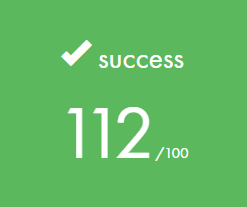

# Libft - My C Standard Library
My implementation of some of the Standard C Library functions.

### What is libft?
Libft is an individual project at [42](https://www.42sp.org.br) that requires us to re-create some [C standard library](https://www.tutorialspoint.com/c_standard_library/index.htm) functions including some additional ones that can be used later to build a library of useful functions for the rest of the program.

### Badge


#### Objectives
- Unix logic

#### Skills
- Rigor
- Algorithms & AI
- Imperative programming

#### My grade


## Getting started
**Follow the steps below**
```bash
# Clone the project and access the folder
git clone https://github.com/gialexan/libft-42 && cd libft/
# Run Make so you can build the library
make
# Run Make with bonus if you want chained lists manipulation functions
make bonus
# Compile your main with the library, example:
clang main.c libft.a
# Execute your program
./a.out
# Clean output objects with
make fclean
# Well done!
```